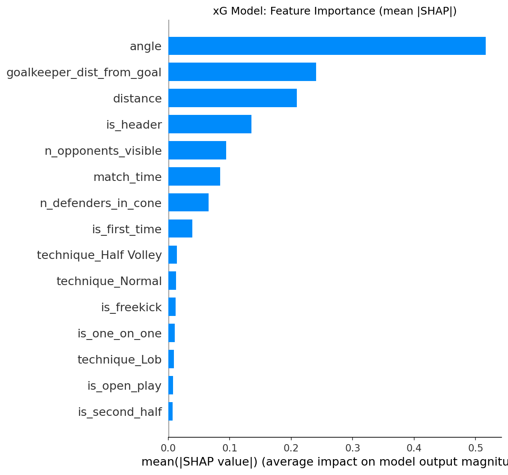
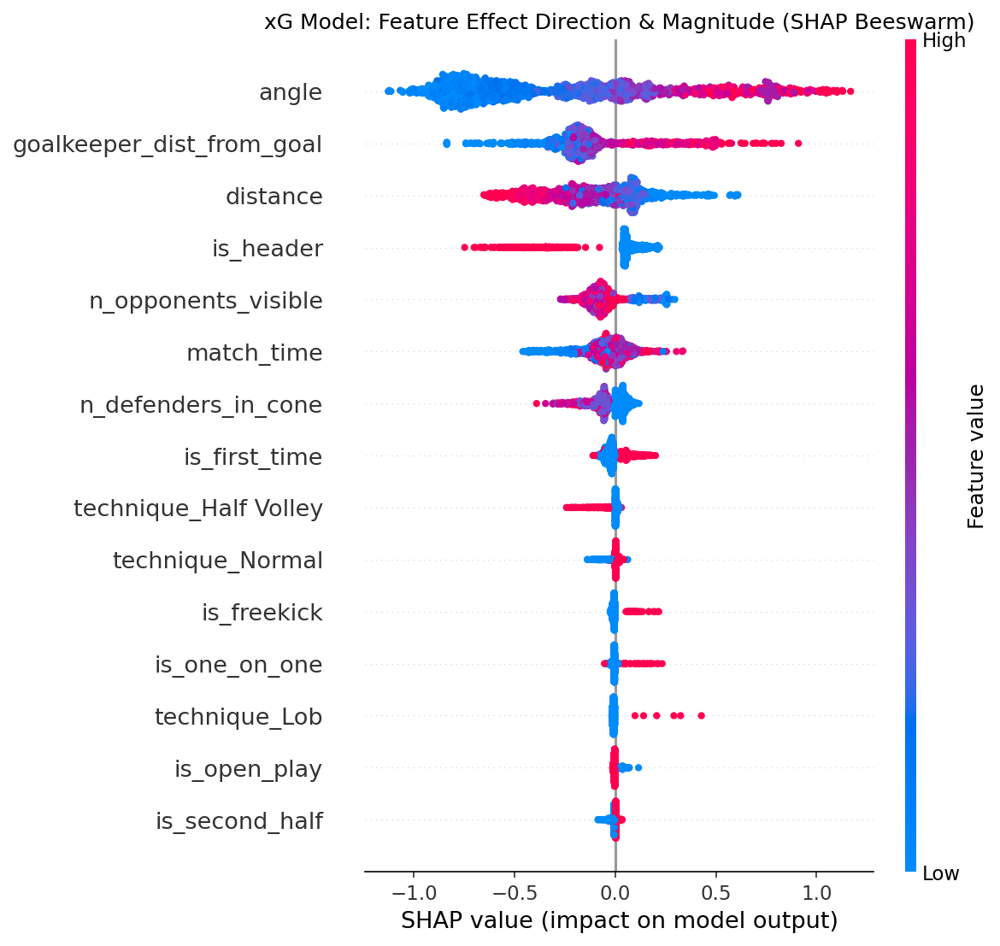
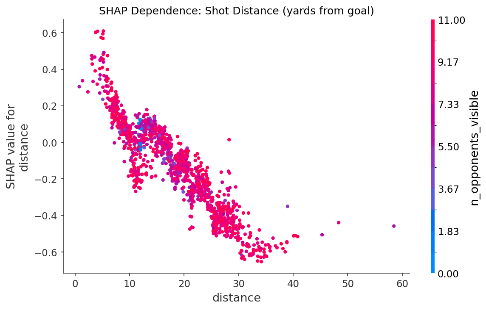
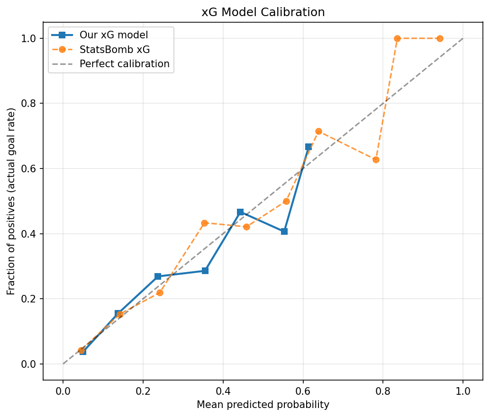

# Real-Time In-Play Soccer Betting Engine
## Expected Goals (xG) Prediction + Optimal Bet Sizing

> A production-minded data science project demonstrating the core techniques used by sports betting analytics teams — xG modelling, real-time in-play prediction, Expected Value calculation, and fractional Kelly bet sizing.

---

## Why This Project

Sports betting companies like Bet365, Smarkets, and Pinnacle use Expected Goals (xG) as a foundational signal for every in-play soccer market. This project builds the full stack from raw event data to live betting recommendations:

- **xG model** — XGBoost classifier on StatsBomb shot-level geometry + freeze-frame defensive context
- **Calibrated probabilities** — Platt scaling ensures outputs are usable in EV/Kelly formulas
- **Match simulator** — Poisson/Dixon-Coles model converts team xG into a full score distribution
- **EV engine** — evaluates every standard market (1X2, over/under, BTTS) against bookmaker odds
- **Kelly Criterion** — sizes each value bet optimally as a fraction of bankroll
- **In-play engine** — processes live shot events, updates probabilities, emits bet signals

---

## Results

Trained on FIFA World Cup 2018 + La Liga 2017/18 & 2018/19, tested on **UEFA Euro 2020** (never seen during training):

| Metric | Our xG model | StatsBomb xG (benchmark) |
|--------|-------------|--------------------------|
| **Brier score ↓** | 0.085 | 0.079 |
| **AUPRC ↑** | 0.440 | 0.501 |
| **AUROC ↑** | 0.806 | 0.838 |

The gap vs StatsBomb is expected — they use proprietary full-body tracking. Our model uses only open-data features (geometry + freeze frame summary).

---

## Key Visualisations

<table>
<tr>
<td><br><em>Global feature importance (SHAP bar)</em></td>
<td><br><em>Feature effect directions (SHAP beeswarm)</em></td>
</tr>
<tr>
<td><br><em>SHAP dependence: distance (top predictor)</em></td>
<td><br><em>Calibration vs StatsBomb benchmark</em></td>
</tr>
</table>

---

## Architecture

```
StatsBomb open data
       │
       ▼
data/download_data.py          ← Downloads shots for 3 training + 1 test competition
       │
       ▼
features/shot_features.py      ← Distance, angle, freeze-frame, context (20 features)
       │
       ▼
models/xg_model.py             ← XGBoost + Platt calibration + SHAP interpretation
       │
       ├──▶ models/match_simulator.py   ← Poisson/Dixon-Coles score distribution
       │
       └──▶ betting/ev_calculator.py   ← EV for each market
                │
                ▼
           betting/kelly.py            ← Fractional Kelly bet sizing
                │
                ▼
           inplay/engine.py            ← Real-time event stream → live bet signals
```

---

## Quick Start

```bash
# 1. Clone and set up environment
git clone https://github.com/bachnguyennn/Expected-Goal-Prediction.git
cd Expected-Goal-Prediction

python3.10 -m venv .venv
source .venv/bin/activate
pip install -r requirements.txt

# 2. Run the full pipeline (downloads data, trains model, generates all plots)
python run_pipeline.py

# 3. Explore results in the notebook
jupyter notebook notebook/xG_Betting_Analysis.ipynb
```

**Common flags:**
```bash
python run_pipeline.py --skip-download  # use existing data
python run_pipeline.py --no-shap        # skip SHAP (faster)
python run_pipeline.py --tune           # run Optuna hyperparameter search first
python run_pipeline.py --demo-only      # skip training, run EV/Kelly demo only
```

---

## Project Structure

```
Expected-Goal-Prediction/
├── data/
│   ├── raw/                        # shots_raw.parquet (downloaded, not committed)
│   ├── processed/                  # shots_featured.parquet (built, not committed)
│   └── download_data.py            # StatsBomb API: WC2018 + La Liga + Euro2020
│
├── features/
│   └── shot_features.py            # 20 xG features incl. freeze-frame context
│
├── models/
│   ├── xg_model.py                 # XGBoost xG + Platt calibration + SHAP
│   ├── match_simulator.py          # Poisson/Dixon-Coles match outcome simulator
│   └── artifacts/
│       ├── xg_model.joblib         # trained calibrated model
│       ├── xg_metrics.json         # evaluation metrics
│       └── test_predictions.parquet
│
├── betting/
│   ├── ev_calculator.py            # Expected Value engine for all markets
│   └── kelly.py                    # Kelly Criterion + fractional Kelly sizing
│
├── inplay/
│   └── engine.py                   # Real-time in-play prediction engine
│
├── notebook/
│   └── xG_Betting_Analysis.ipynb  # Full analysis: EDA → model → SHAP → betting
│
├── reports/figures/                # SHAP plots, calibration, xG distribution
├── run_pipeline.py                 # One-command end-to-end runner
└── requirements.txt
```

---

## Feature Engineering

All features are computed from raw StatsBomb event data. The split happens **before** feature engineering — any data-dependent thresholds are learned from training data only.

| Feature | Description |
|---------|-------------|
| `distance` | Euclidean yards from shot position to goal centre |
| `angle` | Degrees of goal opening visible from shot position |
| `is_header` | Shot taken with head (lower xG at same coords) |
| `is_penalty` | Penalty kick (~76% conversion) |
| `is_one_on_one` | Shooter alone vs goalkeeper |
| `under_pressure` | Defender within pressing distance |
| `is_first_time` | Shot without prior touch |
| `n_defenders_in_cone` | Defenders in the direct path to goal (freeze frame) |
| `goalkeeper_dist_from_goal` | How far off his line the keeper is (freeze frame) |
| `is_corner` / `is_counter` | Attack origin — set-piece vs counter-attack |
| `technique_*` | Normal / Lob / Volley / Half Volley |

---

## Betting Engine

### Expected Value
```
EV = p_model × (decimal_odds − 1) − (1 − p_model)
```
Any market where EV > 0 (and EV > minimum edge threshold) is flagged as a value bet.

### Kelly Criterion (quarter-Kelly)
```
f* = (b·p − q) / b        where  b = odds − 1,  q = 1 − p
stake = 0.25 × f* × bankroll     (quarter-Kelly for variance reduction)
```

### Live EV Demo output
```
Market             Model %    Odds       EV   Q-Kelly     Stake
under_2.5           59.6%    1.95   +0.162    4.27%    £42.70 ← VALUE
btts_no             53.6%    2.00   +0.073    1.82%    £18.24 ← VALUE
draw                30.5%    3.40   +0.038    0.39%     £3.94 ← VALUE
```

---

## Notebook Highlights

`notebook/xG_Betting_Analysis.ipynb` contains 8 fully-executed sections:

1. **Dataset overview** — competition breakdown, goal rates, train/test rationale
2. **EDA** — pitch maps, distance/angle distributions, conversion by situation
3. **Model evaluation** — AUPRC/ROC curves, calibration, xG distribution
4. **SHAP interpretation** — bar, beeswarm, dependence + learned xG surface plot
5. **Match simulation** — score probability heatmap, market distribution
6. **xG sensitivity** — how win/draw/loss and over/under shift as xG changes
7. **EV + Kelly** — EV surface, Kelly curves, full pre-match bet report
8. **In-play tracking** — 4-panel: win probability drift, cumulative xG, O/U drift, live EV snapshots

---

## Data Source

**StatsBomb open data** — free for academic and public use.  
[github.com/statsbomb/open-data](https://github.com/statsbomb/open-data)

Competitions used:
| Competition | Role | Shots |
|-------------|------|-------|
| FIFA World Cup 2018 | Train | 1,706 |
| La Liga 2017/18 | Train | 971 |
| La Liga 2018/19 | Train | 887 |
| UEFA Euro 2020 | **Test** | 1,289 |

---

## Limitations

- StatsBomb's xG model (benchmark) uses full body-position tracking. Closing the gap requires licensed tracking data (Tracab, SkillCorner) or StatsBomb 360.
- The EV and Kelly outputs use illustrative odds. Production deployment needs a live odds feed (Betfair Exchange, Pinnacle API).
- Profitable accounts are routinely limited by bookmakers — exchange betting is the only path to sustained volume.
- The model is static; a production system retrains weekly and incorporates team form, injuries, and weather.

---

## Tech Stack

`XGBoost` · `scikit-learn` · `StatsBombPy` · `SHAP` · `Optuna` · `SciPy` · `pandas` · `matplotlib`

---

*Built as a portfolio project demonstrating production-grade sports betting analytics — from raw event data to live bet recommendations.*
